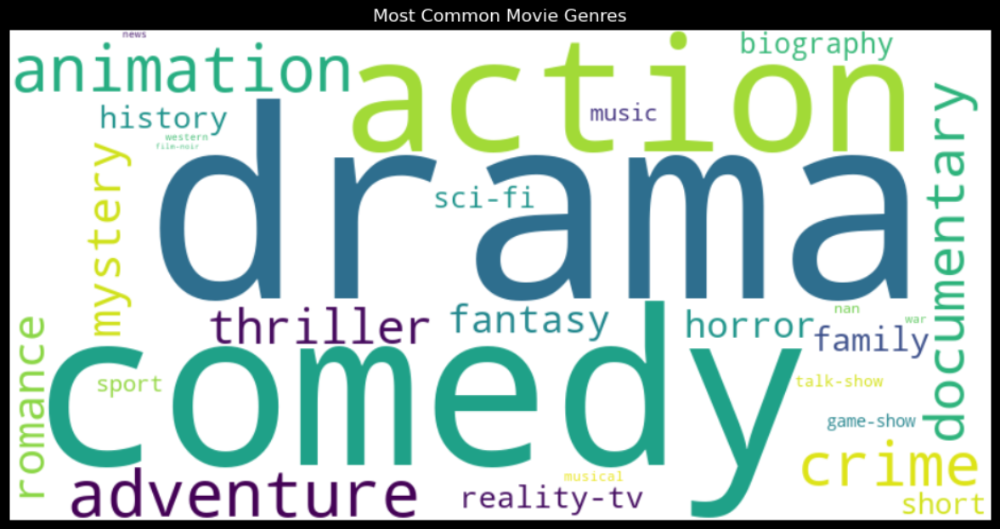

# movie recommendation system
#### Movie recommendation system

## Scenario
As a movie streaming platform, I want to understand movie trends and user preferences based on movie features, so that I can provide personalized recommendations to my users. The goal is to analyze movie data, uncover patterns in movie ratings, genres, and other key factors, and then implement a content-based recommendation system to suggest similar movies to users.

## What this usecase will teach me
At the end of this use case I will:

Clean and preprocess a movie dataset, including handling missing values.
Perform exploratory data analysis (EDA) to uncover insights into movie trends, ratings, and genres
Use machine learning techniques to predict movie ratings based on multiple features.
Visualize patterns in the dataset using data visualization techniques.
Build a content-based recommendation system using movie metadata.

## Introduction
This project aims to explore movie data and develop a content-based recommendation system. Movie recommendation systems are widely used in streaming platforms like Netflix and Amazon Prime to enhance user experience by suggesting movies based on their viewing history or preferences. By leveraging a dataset of movies with attributes like genre, ratings, runtime, and brief descriptions, we aim to analyze key factors that influence movie success and develop a system that recommends similar movies based on content.

In this project, we use a dataset containing movies, genres, ratings, and more, to uncover trends in movie success and develop a recommendation system. The content-based recommendation system will utilize features such as genre and textual movie descriptions to suggest similar movies to users based on the attributes of movies they have enjoyed in the past.

#### Data source:

The dataset includes information on:

- Movie titles, genres, and release year
- Ratings and number of votes
- Movie runtime and description
- Cast and directors

  

## Skills Applied in the Movie Recommendation Project
- Data Processing & Preparation:
- Data Cleaning & Transformation:
- One-Hot Encoding & Feature Engineering:
- Text Processing:
- Exploratory Data Analysis (EDA):
- Visual Libraries:
- Utilized Visual Libraries like Matplotlib, Seaborn, and WordCloud to create clear and informative visualizations.
- Machine Learning & Modeling:
- Unsupervised Learning:
- Dimensionality Reduction(PCA):
- Similarity Measures(cosine similarity):
- Data Standardization(standarsScaler):
- Pandas & Numpy:
- Scikit-Learn:
- Utilized for TF-IDF Vectorization, K-Means clustering.

### Data cleaning/preparation
- Data loading and inspection
- Handling missing Values
- Data cleaning and formatting

### Data exploratory
EDA involved exploring the movie data to answer key questions such as

- [Number of Movies Released Per Year](#number-of-movies-released-per-year)
- [Number of Movies Released in Different Decades](#number-of-movies-released-in-different-decades)
- [Analyzing the Trend of Average Rating, Votes, and Runtime](#analyzing-the-trend-of-average-rating-votes-and-runtime)
- [Average Votes Per Year (Middle Plot)](#average-votes-per-year-middle-plot)
- [Checking if Movies With More Votes Tend to Have Higher Ratings](#checking-if-movies-with-more-votes-tend-to-have-higher-ratings)
- [What Are the Most Common Genres?](#what-are-the-most-common-genres)
- [Analyzing the Average Number of Votes Per Genre. Are certain genres more popular or attract more voters than others?](#analyzing-the-average-number-of-votes-per-genre.-Are-certain-genres-more-popular-or-attract-more-voters-than-others?)
 - [Runtime by Genre](#runtime-by-genre)
- [Top Rated Movies](#top-rated-movies)
- [Most Voted Movies](#most-voted-movies)
- [Comparing Top 10 Most Voted and Top-Rated Movies](#comparing-top-10-most-voted-and-top-rated-movies)
- [Longest Runtime Analysis](#longest-runtime-analysis)
- [Comparing the Runtime and Rating of Movies](#comparing-the-runtime-and-rating-of-movies)

#### Feature Engineering
- Feature selection
- One-Hot Encoding
- Text Processing:

#### Machine learning & Modelling
- Machine Learning & Modeling:
- Unsupervised Learning:
- Dimensionality Reduction(PCA):

  

## Number of Movies Released Per Year
This analysis was conducted to examine the number of movies released each year, highlighting the trends in movie production over time. A bar chart was created to display the top 20 years with the highest number of movie releases, providing a clear view of how the movie industry has evolved.
## 

This bar chart presents the trend of movie releases from 2001 to 2020, showing a significant rise in production over time, with the peak occurring in 2020 at 2,442 movies. The visual highlights a gradual increase in movie releases from 2001, where fewer than 50 movies were released annually, to a marked acceleration in recent years

#### Key Insights:
>
- 2020 saw a dramatic surge in movie releases, reaching the highest point in the dataset. This could be due to the proliferation of digital platforms like Netflix and Amazon Prime, enabling more films to be distributed directly to consumers.
- The second highest number of releases occurred in 2019 with 1,420 movies, suggesting a consistent upward trend in the last decade.
Prior to 2010, movie production was relatively low compared to recent years. Between 2001 and 2007, the number of annual releases was below 100, but a steady increase is observed after 2008.
The sharp rise after 2014 aligns with the growth of independent film-making, streaming services, and lower production costs, which have democratized the movie industry.
- Explanation for the Trend: This trend reflects the transformation of the movie industry, driven by technological advancements and the shift toward online streaming platforms. It also points to the increasing demand for content, as well as changes in the way movies are produced and distributed. Understanding these trends is essential for building predictive models or recommendation systems that cater to current production and consumption patterns.

  

## Number of Movies Released in Different Decades
This analysis provides a long-term view of how the movie industry has evolved over the years, highlighting significant periods of growth and change.
## 

This bar chart shows how many movies were released in each decade, from the 1930s to the 2020s. The data reveals some important trends:

#### Key Insights:
>
- 2010s: The 2010s saw the highest number of movie releases, with 5,451 movies. This huge increase is likely due to the rise of streaming platforms like Netflix and Amazon Prime, which made it easier to produce and distribute movies.
- 2020s: Even though the 2020s aren't over yet, there have already been 3,702 movies released, showing that the movie industry continues to grow rapidly.
- 2000s: The 2000s marked the beginning of this upward trend, with 637 movies released. This is when digital filmmaking and online distribution started to gain popularity.
Earlier Decades: From the 1930s to the 1990s, movie production was much lower, with fewer than 100 movies released per decade. This was because making and distributing films was more expensive and harder to do before the digital age.
### Explanation for Trends:

- Technology: Starting in the 2000s, new technology made it cheaper and easier to make movies. The rise of digital cameras and editing software lowered the cost, allowing more filmmakers to enter the industry.
- Streaming Services: Platforms like Netflix and Amazon Prime have played a big role in the huge increase in movie releases, especially in the 2010s and 2020s. These platforms have increased the demand for more content, leading to more movies being made.

  

## Analysing the trend of average rating, votes and runtime

### Average Rating per Year (Top Plot):

- The average movie ratings have remained relatively high and stable, mostly between 6.0 and 8.0, from the 1930s up to 2020.
- There is some fluctuation in ratings during the 1960s to 1990s, with peaks reaching as high as 8.0 in certain years.
- In recent years, the average ratings have been more consistent, showing a slight upward trend.

### Average Votes per Year (Middle Plot):

- The number of votes has significantly increased starting from the 1960s, with a major spike around the 1980s and 1990s.
- This increase reflects the growing popularity of movies and wider audience engagement, likely due to better access to films and the rise of internet platforms where users can vote.
- After the peak in the 1980s and 1990s, the average votes per year have gradually decreased, which might suggest changes in how movies are distributed or voted on.

### Average Runtime per Year (Bottom Plot):

- Movie runtimes have varied widely over the years. The data shows a notable increase in average runtime in the 1960s, with movies during that period running longer, peaking at around 175 minutes.
- Over time, average runtimes have gradually decreased, especially in more recent years, stabilizing around 100 minutes, possibly due to modern audiences preferring shorter films or the rise of content like TV shows and web series that are designed for quicker consumption.
- This may reflect changing audience preferences or trends toward shorter, more concise movies in the digital age.

  

## checking if movies with more votes tend to have higher ratings.
This analysis helps to understand if more popular movies (with higher votes) tend to have higher ratings, and vice versa.

This scatter plot visualizes the relationship between votes (on the y-axis) and ratings (on the x-axis) for movies. Each dot represents a movie, where its position on the x-axis indicates its rating and its height on the y-axis indicates the number of votes it received.

#### Key Insights: General Trend:
>
- Movies with higher ratings (closer to 10) tend to have more votes. There is a visible upward trend where movies with ratings above 7.0 generally attract more votes, suggesting that higher-rated movies are more popular and receive more viewer engagement. Cluster of Low Ratings with Few Votes:

- Movies with ratings below 6.0 tend to have fewer votes. This could indicate that lower-rated movies attract less attention or may appeal to smaller, niche audiences. Highly Voted Movies with High Ratings:

- A group of movies with ratings between 8.0 and 9.5 has received the highest number of votes (over 1 million). These are likely popular and highly rated movies that resonate with large audiences.

  

## what are the most common genres?

The word cloud above shows the most common movie genres in the dataset. The bigger the word, the more common that genre is. For example, "Drama," "Comedy," "Action," and "Adventure" are the largest words, meaning these genres appear most often in the movies we have. This suggests that these types of movies are very popular or are produced more frequently.
>
Other genres, like "Documentary," "Crime," and "Animation," are also shown but are a bit smaller, which means they are less common than the top genres but still significant. You can also see a wide range of genres, like "Horror," "Romance," and "Reality-TV," showing that there is a good mix of movie types available.

  

## Analyzing the average number of votes per genre. Are certain genres more popular or attract more voters than others?
The goal is to determine which genres are more popular or attract more audience engagement as reflected by the number of votes.

### Observations:

- Sci-Fi, Thriller, and Crime genres dominate with the highest average number of votes, with Sci-Fi topping the chart at nearly 40,000 average votes. These genres typically feature blockbuster films that attract broad audiences and garner significant attention.

- The Thriller and Crime genres are also highly popular, which might be due to the suspense and intense storylines that appeal to wide audiences across different demographics. Mid-Range Genres:

- Adventure, Action, Fantasy, and Biography genres fall in the middle tier, with an average of 15,000-20,000 votes. These genres likely include a mix of mainstream and niche films that generate steady but not overwhelmingly large engagement.

- Musical, Horror, and Drama genres also fall in this mid-range category, with decent engagement. These genres often include cult classics or emotionally driven films that resonate with specific audience groups. Genres with Lower Engagement:

- Reality-TV, Talk-Show, Game-Show, and News genres receive significantly fewer votes, with Game-Show and Talk-Show barely crossing the 2,000-vote threshold. This reflects their niche appeal and limited engagement compared to more widely popular movie genres.

- Documentary and Short Films also have lower average votes, likely because these genres cater to more specialized or educational audiences. Niche Genres:

- Film-Noir, Western, and Family genres, while not among the top in terms of votes, still have a steady fanbase, garnering between 8,000-12,000 votes on average. These genres have dedicated but smaller audience groups, and while they may not generate the highest vote counts, they have consistent appeal to specific viewers.

  

## Runtime by Genre:
comparing movie runtimes across different genres. This could reveal if certain genres (e.g., drama or action) tend to have longer or shorter runtimes.

- Top Runtimes: The chart shows that genres such as war, western, and biography have the highest average runtimes, around 100 minutes. This could suggest that these genres often include detailed storytelling that requires longer screen time.
- Moderate Runtimes: Genres like thriller, horror, music, and musical have average runtimes between 80 to 90 minutes.
- Shorter Runtimes: Genres like animation, short, and game-show have the shortest average runtimes, with averages below 60 minutes. This is likely due to the nature of these genres; for example, short films are designed to be concise.

  

## Top rated movies
This provides insight into which movies have achieved exceptional ratings and how diverse or varied these top-rated films are in terms of genres and content.

-Highest Rated: The top-rated movie is "Avatar: The Last Airbender" (2005) with a 9.9 rating, which appears multiple times in the list, indicating episodes or specific seasons that are highly regarded.
-Diversity: The list includes a mix of animated series (e.g., "BoJack Horseman", "She-Ra and the Princesses of Power") and dramas (e.g., "Dexter", "Dark").
-Consistent Ratings: All movies on the list have very high ratings, ranging from 9.6 to 9.9, showing they are well-loved by audiences.

  

## Most Voted Movies
The top 10 movies with the most votes.

- Top Movie: "The Lord of the Rings: The Fellowship of the Ring" holds the highest number of votes with 1,711,028 votes, suggesting it is extremely popular.
- Series Dominance: The chart includes multiple movies from the "The Lord of the Rings" franchise, indicating that this series is highly favored by audiences.
- Variety: While the top three movies are part of well-known series (including "Breaking Bad"), the list also includes standalone hits like "The Departed", "Gone Girl", and "Kill Bill: Vol. 1".
- TV Shows Included: The presence of TV series like "Stranger Things" and "The Walking Dead" shows that the most-voted content isn’t limited to movies but includes popular series as well.

  

## comparing Top 10 Most Voted and Top-Rated Movies: 
This comparison was done to determine if there is an alignment between popularity (measured by the number of votes) and quality (measured by ratings)

This plot (light blue) represents the number of votes each movie received, while the red line plot represents the corresponding ratings.

#### Key Insights:
>
- The most voted movies such as The Lord of the Rings series, Breaking Bad, and Jurassic Park received well over a million votes, indicating their popularity. However, their ratings range between 8.5 and 9.0, which are slightly lower than the top-rated movies.
- The highest-rated movies, including Avatar: The Last Airbender, BoJack Horseman, and She-Ra and the Princesses of Power, have consistently high ratings of 9.7 to 9.8, but they attracted significantly fewer votes compared to the most voted movies.
- The plot reveals that popularity (votes) and quality (ratings) don't always align. Highly voted movies are not always the highest-rated, and top-rated movies tend to attract more niche or dedicated audiences.
>
This visualization shows the relationship between popularity and quality. Some movies are very popular and get a lot of votes, while others are highly rated but have fewer viewers. Knowing this can help in making better content recommendations, marketing decisions, and targeting the right audience for different types of movies.

  

## Longest Runtime Analysis
This analysis was to identify movies with the longest runtimes and explore whether these movies tend to have higher or lower ratings.

- Longest Runtime: "El tiempo entre costuras" has the longest runtime, exceeding 800 minutes. This might indicate it is a miniseries or a multi-episode format.
- Other Notable Movies: "Soupçons", "The Innocence Files", and "The Haunting of Hill House" also have runtimes above 500 minutes, suggesting they may be lengthy documentaries or multi-episode series.

  

## comparing the runtime and rating of movies
This comparison helps determine if longer or shorter movies tend to have higher or lower ratings. This informed decisions about content development and audience engagement strategies

General Observations:

- The movies or series shown in the plot have runtimes ranging from approximately 450 to 850 minutes and ratings between 6.5 and 9.5.
>
- Longest Runtime: The movie "El tiempo entre costuras" has the longest runtime, close to 850 minutes, and a rating around 8.5. Highest Ratings:
>
- "Soupçons" is among the highest-rated, with a rating close to 9.0 and a runtime of around 550 minutes.
>
- "The Innocence Files" and "The Haunting of Hill House" also feature high ratings (approximately 8.5 to 9.0) and runtimes between 600 to 650 minutes. Moderate to Lower Ratings:
>
- "Dogs of Berlin" and "The Last Dance" have ratings between 7.0 and 8.0, with runtimes of 500 to 550 minutes.
>
- "El inocente" has the lowest rating in the plot, approximately 6.5, with a runtime of around 500 minutes. Insights:
>
No Clear Correlation: The plot shows that while some long movies or series are highly rated, others with similar runtimes receive moderate or lower ratings. This suggests that there is no straightforward correlation between runtime and rating.

  

## Clustering Movies
#### This could reveal patterns or clusters of movies that tend to be similar
The goal was to identify patterns and create clusters that reveal similar types of movies, such as action-packed, highly-rated thrillers or family-friendly animations. This analysis provides insights into movie segmentation and can guide content recommendations and marketing strategies.

This chart, titled "Genre Distribution by Cluster," illustrates how different movie genres are distributed within each cluster. Each bar represents a cluster of movies, and the colors within the bar signify different genres. The height of each color segment shows the percentage of that genre in the cluster, giving us insights into the dominant genres and overall genre composition of each cluster.

Breakdown of Each Cluster Cluster 0:

- Dominant Genres: Primarily composed of Action and Adventure movies, with some Comedy and Animation. This cluster represents high-energy, family-friendly movies, appealing to audiences looking for entertaining, light-hearted content.

- Potential Audience: Likely to attract family-friendly viewers and casual audiences who enjoy adventurous and animated films. Cluster 1:

- Dominant Genres: This cluster has a diverse mix, with substantial representation from Drama, Comedy, and Documentary genres. Movies in this cluster are story-driven and well-rounded, making them suitable for a general audience with varied tastes.

- Potential Audience: Appeals to a broad audience looking for well-rounded, engaging narratives, including both casual viewers and those interested in documentaries. Cluster 2:

- Dominant Genres: Contains a significant proportion of Family and Animation movies, along with Adventure films. This cluster is family-oriented, featuring movies that are suitable for all ages, with a mix of fun, animated, and light-hearted genres.

- Potential Audience: Ideal for family audiences or younger viewers looking for safe, entertaining options. Cluster 3:

- Dominant Genres: Composed mainly of Drama, Crime, Thriller, and Mystery genres. This cluster leans towards suspenseful, intense movies with complex plots. The combination of crime and thriller elements suggests it is suited for audiences looking for excitement and intrigue.

- Potential Audience: Likely to attract adult viewers who enjoy thrillers, mysteries, and story-driven content with a darker tone. Cluster 4:

- Dominant Genres:Features a unique combination, with a strong presence of Documentary and History genres, as well as some Drama and Crime. This cluster represents more educational or factual content, appealing to audiences interested in documentaries or historical themes. Potential Audience: Attracts viewers who enjoy learning and factual narratives, such as documentaries and historical dramas.
>
By identifying the genre focus of each cluster, we can tailor recommendations and marketing strategies more effectively. For instance, users frequently watching movies in Cluster 2 (family-friendly) are likely to appreciate more animated or family-focused content. On the other hand, users interested in Cluster 3 may prefer thrillers or suspenseful genres, and we can recommend similar titles. This clustering also enables targeted marketing campaigns by aligning content with viewer preferences, enhancing engagement and viewer satisfaction.

  

## Recommendation system

A content-based recommendation system was developed to suggest movies that are similar to a user’s preferred movie. For my system, I used key features such as **genres**, **one-line**, **directors**, and **star_names** to find and recommend movies that align closely with user preferences. The recommendation system is further enhanced with filters for **year** of release, **ratings**, and **runtime**, allowing users to customize their viewing options.

Approach:
>
#### Content-Based Filtering:
The system identifies similarities between movies based on shared attributes, such as genre, plot, and cast. By leveraging TF-IDF (Term Frequency-Inverse Document Frequency) and cosine similarity, the system measures how closely related different movies are.
>
#### Customization and Filters:
Users can refine their recommendations based on specific criteria like the release year, ratings, and runtime to tailor their viewing experience.

### Conclusion
This use case has been a comprehensive project showcasing a blend of data analysis, visualization, machine learning, and business insights. Below is a summary of the key achievements, insights, and learning outcomes.

  

## Achievements¶
#### 1. Extensive Data Analysis and insights
Analyzed various aspects of movie data such as genre distribution, average ratings, number of votes, and runtimes.
Gained insights into how movie releases have trended over the years and identified major shifts in production related to technological advancements and the rise of streaming services.
#### 2. Advanced Visualization Techniques:
Created intuitive and diverse visualizations, including bar charts, scatter plots, word clouds, and cluster plots. These visualizations effectively communicated findings and made it easy for - - stakeholders to grasp trends and patterns.
#### 3. Successful Implementation of a Recommendation System:
Developed a content-based recommendation system that leverages key features such as genres, plot descriptions, directors, and actors. Enhanced the system with filters based on user preferences like ratings, year of release, and runtime.
The system provided personalized, high-quality movie recommendations that align with user interests.
#### 4. Clustering and Machine Learning Techniques:
Used K-means clustering to group movies based on their characteristics and visualized the clusters with PCA to identify distinct groupings.
Provided cluster profiles that help understand audience preferences and assist in targeted content recommendations and marketing strategies.

  

### Key Insights and Learning Outcomes
>
#### 1. Trends in Movie Releases:
Significant growth in movie production in the 2010s and 2020s, driven by technological advancements and the rise of streaming platforms.
Movie releases saw a sharp increase after 2014, aligning with the growth of independent filmmaking and the expansion of streaming services.
#### 2. Genre Analysis:
The most common genres were identified using a word cloud, highlighting Drama, Comedy, Action, and Adventure as dominant genres.
Average ratings varied significantly across genres. Animation, Adventure, and History genres received the highest average ratings, while Horror and Reality-TV had lower average ratings.
#### 3. Votes and Ratings Relationship:
Movies with higher ratings often received more votes, indicating their popularity. However, some highly-rated movies had fewer votes, suggesting a niche but highly engaged audience.
Sci-Fi, Thriller, and Crime genres attracted the highest average number of votes, showing their widespread appeal and strong viewer engagement.
#### 4. Runtime Analysis:
Genres like War, Western, and Biography had the highest average runtimes, suggesting detailed storytelling.
Shorter runtimes were common in genres such as Animation, Short, and Game-Show, aligning with the nature of these genres.
Analysis of movies with the longest runtimes revealed no clear correlation between runtime and rating. While some long movies or series were highly rated (e.g., Soupçons), others with similar runtimes received moderate ratings.
#### 5.Top-Rated and Most Voted Movies:
The highest-rated movies included Avatar: The Last Airbender, BoJack Horseman, and She-Ra and the Princesses of Power, all with ratings above 9.0.
The most voted movies featured blockbuster hits like The Lord of the Rings series and Breaking Bad, demonstrating that popularity (votes) and quality (ratings) do not always align perfectly.
#### 6. Clustering Insights:
Clustering analysis revealed patterns in movie characteristics, with distinct groups showing different genre distributions. This can aid in audience segmentation and targeted recommendations.
The clustering visualization highlighted that while some clusters had mixed genres, others had a strong focus on specific genres like Drama, Adventure, and Documentary.
Overall Learning Outcomes:
Enhanced skills in data analysis, feature engineering, and building practical machine learning applications.
Improved understanding of unsupervised learning and its real-world applications in content clustering.
Gained experience in creating stakeholder-friendly visualizations and summaries that bridge technical insights and business applications.
Developed a recommendation system that can be utilized to personalize user experiences, driving engagement and user satisfaction.
